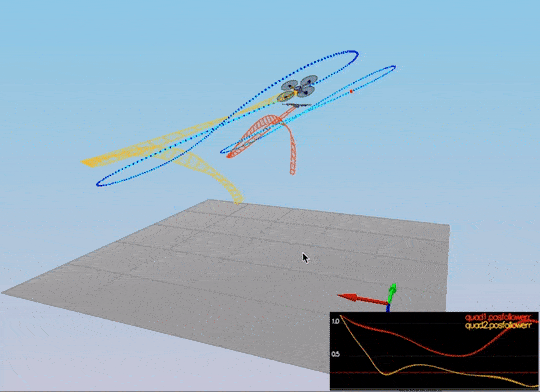

Project Writeup 
Author: Moonsu Kang

[image1]: ./img1.png
[image2]: ./img2.png
[image3]: ./img3.png

## Simulator Walkthrough ##

Now that you have all the code on your computer and the simulator running, let's walk through some of the elements of the code and the simulator itself.

### The Code ###

For the project, the majority of your code will be written in `src/QuadControl.cpp`.  This file contains all of the code for the controller that you will be developing.

All the configuration files for your controller and the vehicle are in the `config` directory.  For example, for all your control gains and other desired tuning parameters, there is a config file called `QuadControlParams.txt` set up for you.  An import note is that while the simulator is running, you can edit this file in real time and see the affects your changes have on the quad!

The syntax of the config files is as follows:

 - `[Quad]` begins a parameter namespace.  Any variable written afterwards becomes `Quad.<variablename>` in the source code.
 - If not in a namespace, you can also write `Quad.<variablename>` directly.
 - `[Quad1 : Quad]` means that the `Quad1` namespace is created with a copy of all the variables of `Quad`.  You can then overwrite those variables by specifying new values (e.g. `Quad1.Mass` to override the copied `Quad.Mass`).  This is convenient for having default values.

You will also be using the simulator to fly some difference trajectories to test out the performance of your C++ implementation of your controller. These trajectories, along with supporting code, are found in the `traj` directory of the repo.

## The Tasks ##

![alt text][image1]

1. Implemented body rate control in C++.
Based on inputs of pqr command and current pqr, the body rate error is calculated and is multiplied by moments of inertia and KpPQR.
BodyRateControl converts the errors into desired moment command, and the result gets passed to GenerateMotorCommands.

 

2. Implement roll pitch control in C++.
Roll pitch control generates outputs of p and q commands that feeds into body rate control. This process involves transformation of world frame into body frame. 
Firstly, convert local accelerations, accelCmd (accelerations in global XY coordinates), into desired rate of local change through following equations.

Then pqr command can be computed based on non-linear transformation based on below equation.

3. Implement altitude controller in C++.
Based on inputs of pos and vel cmd in z, calculate z_err and z_err in velocity. Altitude controller uses PID formula to derive u1bar, and then compute acceleration in altitude by dividing with $b^z$. 

4. Implement lateral position control in C++.
Lateral Position control calculates pos and vel error from current pos/vel with target pos/val and uses the error to derive local acceleration in x,y.

5. Implement yaw control in C++.
Yaw control is decoupled from other directions through below equation:

yaw command is optimized by setting it to be between $[0, 2\pi]$.

6. Implement calculating the motor commands given commanded thrust and moments in C++.
In GenerateMotorCommands, the moment command and thrust gets converted into individual thrustN.
This is done by getting uBar, pBar, qBar, rBar and deciiding which wings needs how much thrust forces in order to meet those.

## Passed scenario tests ## 

![alt text][image2]
![alt text][image3]

